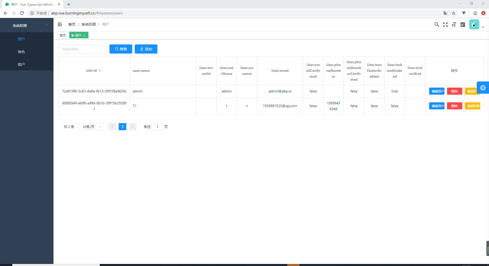

# micro
abpnext+micro+typescript+vue+element

本框架是abpNext微服实现模板，主要给新手操练

## 目录

application 包括微服务服务程序

gateway 服务网关

modules 微服务模块

    base: 系统基础，数据字典，组织，区域
    public: 公用模块
            Unite 统一通用库

vue 后台 vue-element-admin typescript
layui 后台layui
    前端框架计划写一套阿里的[ant.design](https://ant.design/index-cn),这框架支持(React,Angular,Vue)，更适合企业级前端开发 (代码量大)

## 演示

    账户:admin
    密码:1q2w3E*

[vue](http://abp.vue.burningmyself.cn/): http://abp.vue.burningmyself.cn/

[layui](http://abp.layui.burningmyself.cn/views/user/login.html): http://abp.layui.burningmyself.cn/views/user/login.html

## 🤝 参与共建 

请参考[贡献指南](https://github.com/burningmyself/micro/blob/master/.github/CONTRIBUTING.md).

> 强烈推荐阅读 [《提问的智慧》](https://github.com/ryanhanwu/How-To-Ask-Questions-The-Smart-Way)、[《如何向开源社区提问题》](https://github.com/seajs/seajs/issues/545) 和 [《如何有效地报告 Bug》](http://www.chiark.greenend.org.uk/%7Esgtatham/bugs-cn.html)、[《如何向开源项目提交无法解答的问题》](https://zhuanlan.zhihu.com/p/25795393)，更好的问题更容易获得帮助。

## java  spring boot 2.2.2 admin
[spring-boot-admin](https://github.com/burningmyself/ysf): http://ysf.burningmyself.cn:8080
admin  111111
  

